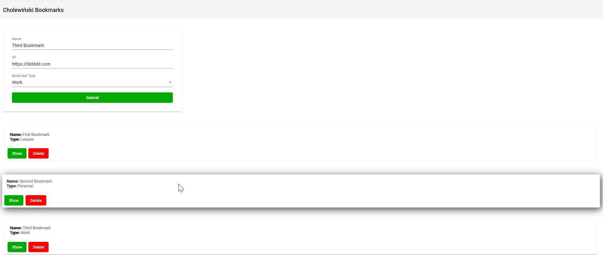

# Bookmarks Application

## Description

The purpose of this project is creating simple bookmarks.

## Setup
To build application run command *npm install* from root directory of project.

To start application run: *ng serve* and open [http://localhost:4200/](http://localhost:4200/)

## Technologies
Technologies used in project:
* Angular 8
* NGRX
* Material Design
* npm

## Example screenshot

## Author
**Michał Cholewiński**, Software Engineer  
[cholewinskimichal.com](https://cholewinskimichal.com)    
[Eager To IT](https://eagertoit.com)

